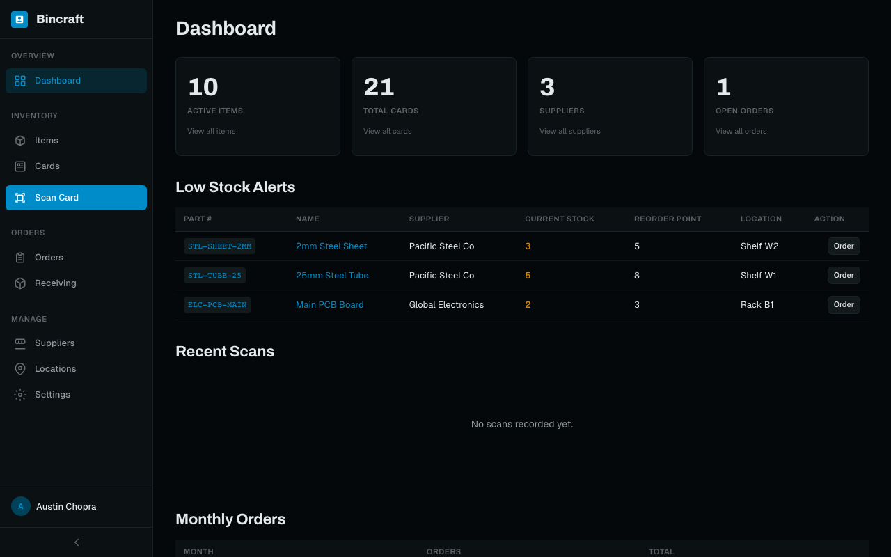
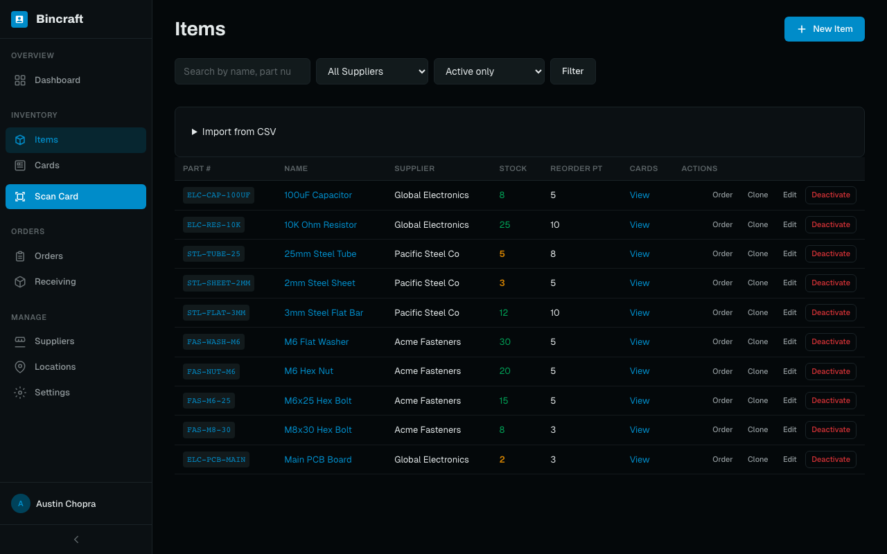
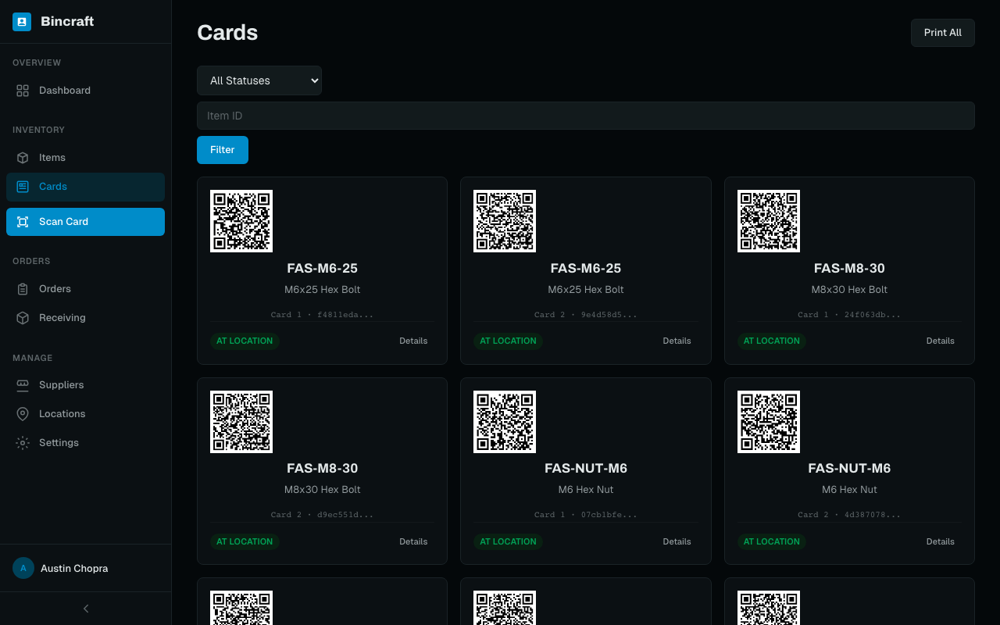
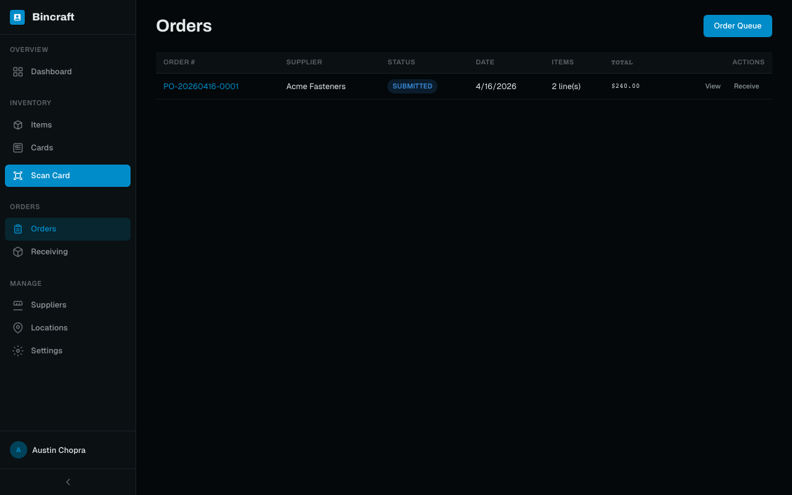
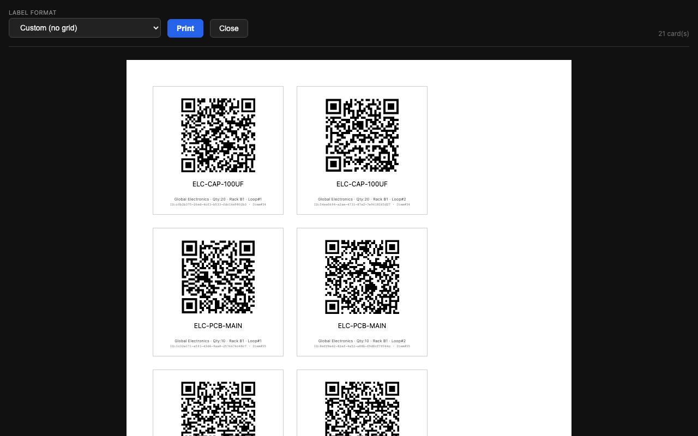
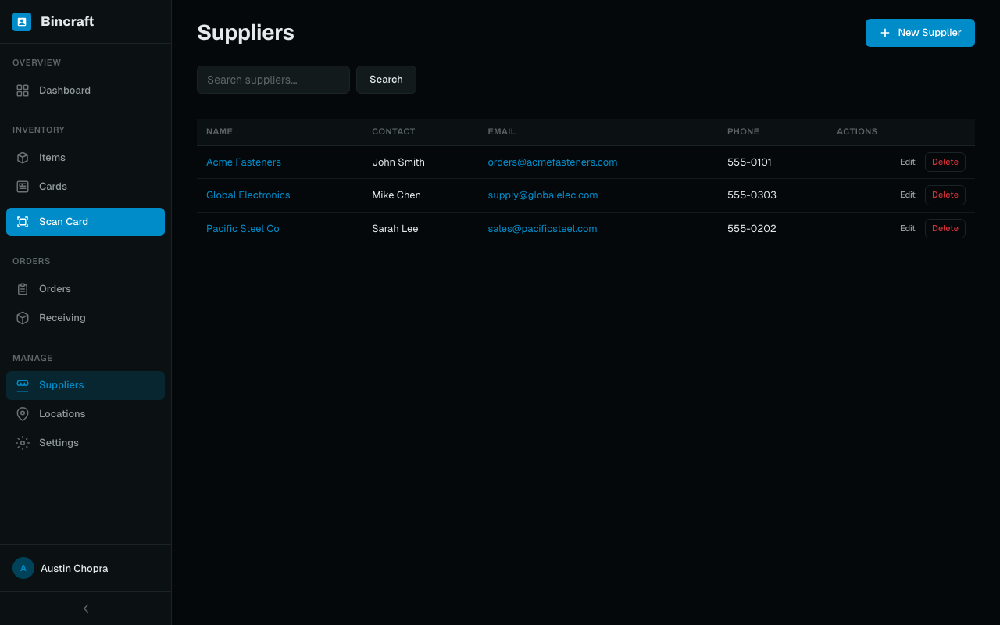
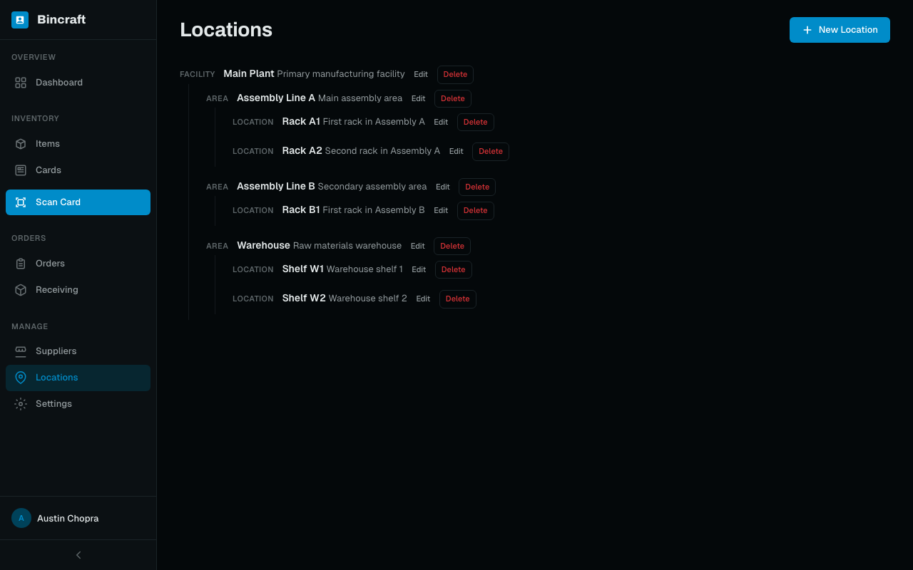

# Bincraft

Kanban-based inventory card and tracking system for manufacturers. Create scannable QR-coded Kanban cards for inventory items, scan them to trigger reorder workflows, manage purchase orders, and track stock levels.



## Features

- **Kanban Cards** — Generate QR-coded cards for inventory items. Print labels for the shop floor with Avery label support.
- **Avery Label Printing** — Print cards to Avery 5160, 5163, 5164, 5167, 5195, 5168, 6572 label sheets, or custom format. Wide labels use a horizontal layout (QR left, text right); square labels use vertical (QR top, text below). Content auto-scales to fit.
- **Label Color Coding** — Assign a color to each item (e.g., red for M6 bolts, blue for M8). The item name prints in that color on labels for quick visual identification on the shop floor.
- **Quick Reorder Links** — Each item can store a supplier URL. A "Reorder" button on the item page opens the URL in a new tab for fast purchasing.
- **Pack Pricing** — Enter cost per individual unit and pack size; the app computes pack price automatically. Each item chooses whether to order by individual unit or by pack. When receiving by pack, stock increments by `quantity × pack_size`.
- **Auto-Receive** — Marking an order as "received" from the status dropdown auto-processes all line items: fills remaining quantities, adds to stock, resets cards to at_location, and logs receipts at each item's default storage location.
- **QR Scanning** — Scan cards via phone/tablet camera to pull items into the order queue.
- **Order Management** — Create purchase orders from queued cards, track status through submission, shipping, and receiving.
- **Receiving & Putaway** — Receive shipments line-by-line with location tracking. Cards cycle back to shelf automatically.
- **Dashboard** — At-a-glance stats, low stock alerts, recent scans, and order summaries.
- **Suppliers & Locations** — Manage suppliers with reliability tracking. Organize locations in a facility > area > location hierarchy.
- **User Management** — Admin-controlled accounts with role-based access (admin, user, viewer). Create users from the Settings page.
- **First-Run Setup** — On first launch with an empty database, a setup page guides you through creating the initial admin account.
- **Settings** — Configurable App URL for QR generation. Bulk QR code regeneration. User management.
- **Mobile Responsive** — Hamburger menu with slide-in sidebar on phones, collapsible icon sidebar on tablets, full sidebar on desktop.

## Screenshots

| | |
|---|---|
|  |  |
| **Items** — Part numbers, stock levels, reorder points | **Cards** — QR-coded Kanban cards with status badges |
|  |  |
| **Orders** — Purchase orders grouped by supplier | **Print** — Avery label print preview with format picker |
|  |  |
| **Suppliers** — Contact info and lead times | **Locations** — Facility → Area → Location hierarchy |

## Tech Stack

- **Backend:** Node.js, Express v5, EJS templates
- **Database:** PostgreSQL
- **Auth:** better-auth (email/password, session management, scrypt hashing)
- **QR Codes:** `qrcode` (server-side generation), `html5-qrcode` (client-side camera scanning)
- **UI:** Custom dark theme CSS design system (Archivo + Geist fonts, OKLCH color tokens), HTMX
- **Module System:** ESM (`"type": "module"`)

## Prerequisites

- **Node.js** v18+
- **PostgreSQL** running locally

## Setup

```bash
# Clone the repo
git clone https://github.com/Austinthemighty/ItemCards.git
cd ItemCards

# Install dependencies
npm install

# Create the database
createdb bincraft

# Copy and edit environment config
cp .env.example .env
# Edit .env with your PostgreSQL connection string

# Run better-auth migrations (creates auth tables)
echo "y" | npx @better-auth/cli migrate

# Start the server
npm start
```

On first run, the app schema tables are created automatically. You'll be redirected to a setup page to create your admin account.

## Scripts

| Command | Description |
|---------|-------------|
| `npm start` | Start the server |
| `npm run dev` | Start with file watching (auto-restart) |
| `npm run db:seed` | Load demo data (3 suppliers, 10 items, 21 cards, 1 order) |

## SSL / HTTPS

The server runs on **ports 80 (HTTP) and 443 (HTTPS)** by default. SSL is configured via the `SSL_MODE` environment variable.

### Modes

| Mode | Behavior |
|------|----------|
| `auto` (default) | Auto-generates a self-signed certificate on first run. Browsers show a warning. Good for local dev. |
| `letsencrypt` | Obtains a free certificate from Let's Encrypt via Certbot. Supports HTTP-01 challenge (port 80) or Cloudflare DNS-01 challenge. Auto-renews. |
| `custom` | Uses your own certificate files specified by `SSL_CERT` and `SSL_KEY` paths. |
| `off` | Disables HTTPS entirely. Serves HTTP-only on port 80. |

### Let's Encrypt Setup

**HTTP-01 challenge** (requires port 80 accessible from the internet):
```bash
SSL_MODE=letsencrypt
SSL_DOMAIN=inventory.yourcompany.com
SSL_EMAIL=admin@yourcompany.com
```

**Cloudflare DNS-01 challenge** (no port 80 needed):
```bash
SSL_MODE=letsencrypt
SSL_DOMAIN=inventory.yourcompany.com
SSL_EMAIL=admin@yourcompany.com
SSL_CF_API_TOKEN=your-cloudflare-api-token
SSL_CF_ZONE_ID=your-zone-id
```

Requires `certbot` installed. For Cloudflare DNS, also install `python3-certbot-dns-cloudflare`.

### Custom Ports

If ports 80/443 require elevated privileges, use higher ports:
```bash
HTTP_PORT=8080
HTTPS_PORT=8443
```

## Environment Variables

| Variable | Default | Description |
|----------|---------|-------------|
| `HTTP_PORT` | `80` | HTTP server port |
| `HTTPS_PORT` | `443` | HTTPS server port |
| `SSL_MODE` | `auto` | SSL mode: `auto`, `letsencrypt`, `custom`, or `off` |
| `SSL_CERT` | — | Path to certificate PEM file (custom mode) |
| `SSL_KEY` | — | Path to private key PEM file (custom mode) |
| `SSL_DOMAIN` | — | Domain for Let's Encrypt |
| `SSL_EMAIL` | — | Email for Let's Encrypt notifications |
| `SSL_CF_API_TOKEN` | — | Cloudflare API token (DNS-01 challenge) |
| `SSL_CF_ZONE_ID` | — | Cloudflare zone ID (DNS-01 challenge) |
| `DATABASE_URL` | — | PostgreSQL connection string |
| `BETTER_AUTH_SECRET` | — | Session secret (change in production) |
| `BETTER_AUTH_URL` | `https://localhost` | App base URL |
| `SMTP_HOST` | — | Optional SMTP host for supplier email notifications |
| `SMTP_PORT` | `587` | SMTP port |
| `SMTP_USER` | — | SMTP username |
| `SMTP_PASS` | — | SMTP password |
| `SMTP_FROM` | `noreply@bincraft.local` | From address for emails |

## Project Structure

```
bincraft/
  server.js                    # Entry point
  src/
    app.js                     # Express app setup
    lib/auth.js                # better-auth instance
    db/
      schema.sql               # PostgreSQL schema
      seed.js                  # Demo data seeder
      index.js                 # DB pool and init
    middleware/
      auth.js                  # requireAuth, requireAdmin, loadUser
      flash.js                 # Cookie-based flash messages
    routes/                    # Express route handlers
    models/                    # Database query functions
    utils/
      qr.js                   # QR code generation
      email.js                # Nodemailer wrapper
      csv.js                  # CSV import parser
      kanban-calc.js           # Card quantity calculator
  views/                       # EJS templates
  public/
    css/style.css              # Design system
    css/print.css              # Print-only styles
    js/app.js                  # Client-side helpers
    js/scanner.js              # QR camera scanner
```

## Kanban Card Workflow

1. **Create items** with part numbers, suppliers, reorder points, and locations
2. **Generate cards** for each item (auto-calculates count or set manually)
3. **Print cards** with QR codes and place on the shop floor
4. **Scan a card** when stock is low — card moves to the order queue
5. **Create a purchase order** from queued cards grouped by supplier
6. **Receive shipment** — enter quantities per line item with putaway locations
7. **Cards reset** to shelf location, completing the Kanban loop

## Database Schema

**Auth tables** (managed by better-auth): `user`, `session`, `account`, `verification`

**App tables**: `suppliers`, `locations`, `items`, `cards`, `orders`, `order_items`, `scan_history`, `receiving_log`, `app_settings`

Cards track status through a state machine: `at_location` → `in_queue` → `ordered` → `in_transit` → `received` → `at_location`

## License

ISC
